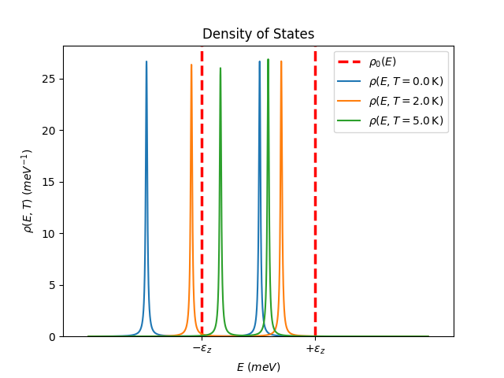
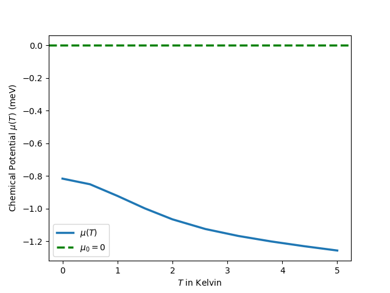
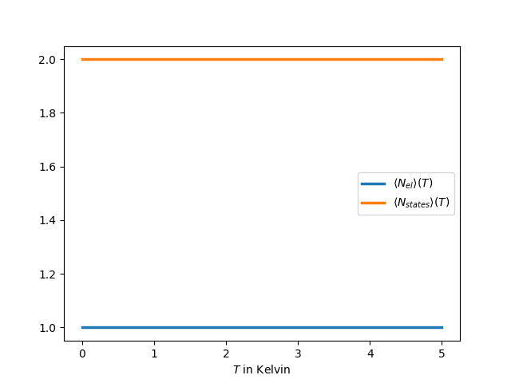
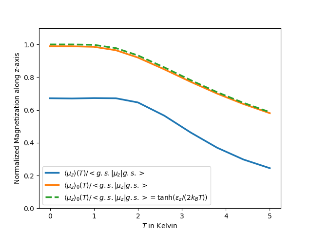

# Green-Function Analysis of an Electron–Phonon System


A compact, reproducible Python implementation of finite-temperature Green-function methods for a small interacting electron–phonon system. The project accompanies the review article **[Quantum many-body Green-functions: theory, interrelations and applications](https://doi.org/10.1088/1361-6404/ae26fc)** and reproduces its illustrative numerical results.

The code is designed as a transparent bridge between the formalism developed in the article and a working numerical calculation. It compares interacting and non-interacting descriptions of a Zeeman-split two-level electronic system coupled to a phonon mode.

## What the project computes

For a configurable temperature grid, the program evaluates:

- the temperature-dependent chemical potential at fixed electron number;
- the electronic occupation and spectral normalization;
- the interacting density of states;
- the magnetization of the interacting and non-interacting systems; and
- the analytical non-interacting magnetization as a numerical benchmark.

The implementation constructs the retarded Green function using Hartree and Fock contributions to the electron–phonon self-energy. Observables are obtained through numerical energy integration, while the chemical potential is determined by a monotonic root search that enforces the requested electron number.

## Results

The repository includes representative output generated with the default model and convergence parameters.

| Density of states | Chemical potential |
|:---:|:---:|
|  |  |
| **Particle number and spectral normalization** | **Normalized magnetization** |
|  |  |

The particle-number and normalization results provide internal consistency checks. The non-interacting magnetization is also compared with its analytical expression,

$$
\frac{\langle \mu_z \rangle_0(T)}{\langle \mathrm{g.s.}|\mu_z|\mathrm{g.s.}\rangle}
= \tanh\!\left(\frac{\epsilon_z}{2k_\mathrm{B}T}\right).
$$

## Getting started

### 1. Clone the repository

```bash
git clone https://github.com/Skalhoef/Sebastians_Green_Functions.git
cd Sebastians_Green_Functions
```

### 2. Create an isolated Python environment

```bash
python3 -m venv .venv
source .venv/bin/activate
```

On Windows, activate the environment with `.venv\Scripts\activate`.

### 3. Install the dependencies

```bash
python -m pip install numpy scipy matplotlib
```

### 4. Run the calculation

```bash
python main.py | tee Output/out.log
```

The figures are written to `Output/`. The same directory also contains `out.log`, which makes the complete terminal output of the run available as a text file—including model parameters, convergence settings, root-search progress, normalization checks, and computed observables. Log files are ignored by Git by default, so each run retains its own local record without adding generated logs to version control.

Matplotlib displays each figure interactively during execution. Close the current plot window to allow the program to continue to the next figure. In a headless environment, run:

```bash
MPLBACKEND=Agg python main.py | tee Output/out.log
```

## Configuration

All physical and numerical parameters are collected in [`params.py`](params.py). The principal settings include:

| Parameter | Meaning | Default |
|---|---|---:|
| `B` | External magnetic field | 10 T |
| `Omega` | Phonon energy | 10 meV |
| `g_int` | Electron–phonon coupling strength | 5 meV |
| `N_el` | Target electron number | 1 |
| `T_min`, `T_max` | Temperature range | $10^{-4}$–5 K |
| `n_T` | Number of temperature points | 10 |
| `E_max` | Energy-integration bound | 30 meV |
| `eta` | Retarded Green-function broadening | 0.01 meV |

The temperature mesh is intentionally denser at low temperature, where the observables vary most rapidly. Increasing `n_Energy` or reducing `eta` can improve spectral resolution at the cost of additional runtime and potentially more demanding numerical convergence.

## Project structure

```text
.
├── main.py        # Runs the temperature sweep and creates the figures
├── params.py      # Defines physical constants and numerical parameters
├── utilities.py   # Implements Green functions, self-energies, integration,
│                  # root finding, observables, and DOS plotting
└── Output/        # Generated figures and the optional execution log
```

## Scientific context

This repository is the computational example associated with:

> Sebastian Kalhöfer, “Quantum many-body Green-functions: theory, interrelations and applications,” *European Journal of Physics* **47** (2026) 013002. [https://doi.org/10.1088/1361-6404/ae26fc](https://doi.org/10.1088/1361-6404/ae26fc)

If this code contributes to academic work, please cite the article above. The derivations, conventions, and broader theoretical discussion are provided in the publication.
